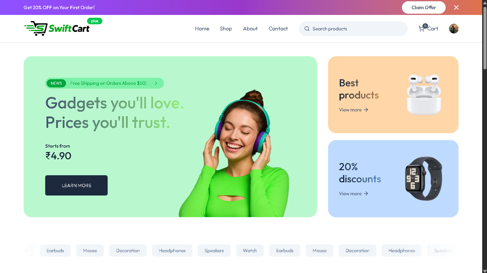
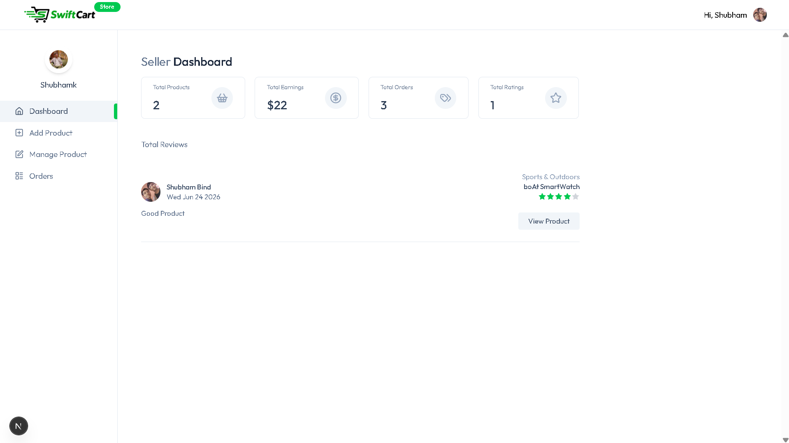
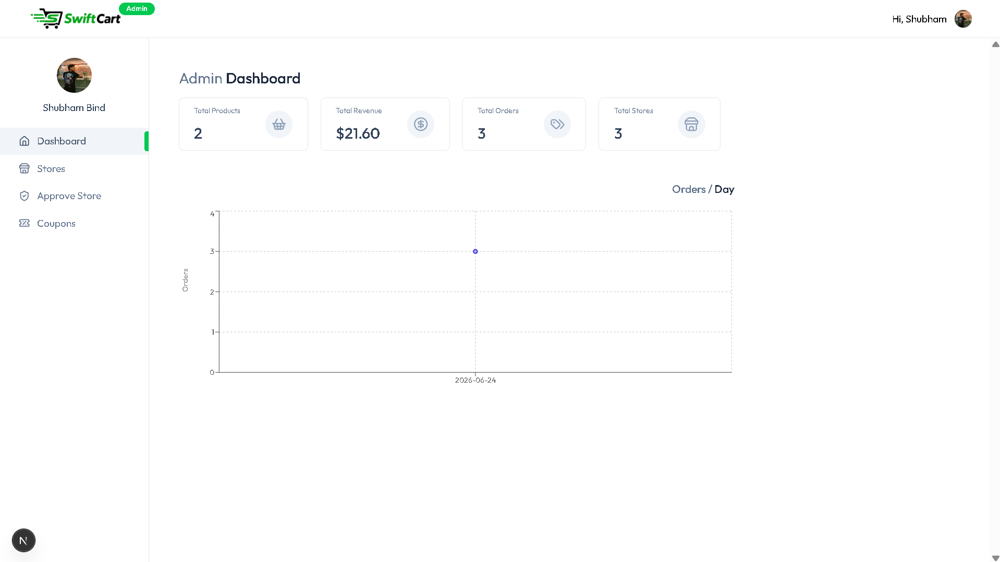

# 🛒 SwiftCart – AI Powered Multi-Vendor E-Commerce Platform

SwiftCart is a full-stack AI-powered multi-vendor e-commerce platform where customers can shop online, sellers can create and manage their own stores, and administrators can control the marketplace through a dedicated admin dashboard.

The platform integrates Google's Gemini API to automatically generate product titles and descriptions from uploaded product images, helping sellers create professional listings in seconds.

---

## 🚀 Live Features

### 👤 Customer Features

* Secure Authentication with Clerk
* Browse Products by Categories
* Search Products
* Add to Cart
* Manage Delivery Addresses
* Apply Discount Coupons
* Place Orders
* Stripe Payment Gateway Integration
* View Order History
* Responsive User Interface

### 🏪 Seller Features

* Seller Registration & Approval System
* Dedicated Seller Dashboard
* Product Management
* Inventory Management
* Order Management
* Store Profile Management
* AI-Powered Product Listing Generator

### 🤖 AI Features

Using Google Gemini API:

* Analyze uploaded product images
* Generate product titles automatically
* Generate detailed product descriptions
* Reduce manual product listing effort
* Editable AI-generated content

### 👨‍💼 Admin Features

* Admin Dashboard
* Approve Seller Applications
* Manage Stores
* Activate / Deactivate Stores
* Manage Coupons
* Monitor Marketplace Activity

---

## 🛠 Tech Stack

### Frontend

* Next.js 15
* React 19
* Tailwind CSS
* Redux Toolkit
* Axios

### Backend

* Next.js API Routes
* Node.js

### Database

* PostgreSQL
* Neon Database
* Prisma ORM

### Authentication

* Clerk Authentication

### AI Integration

* Google Gemini API
* AI Image Analysis
* Automated Product Title Generation
* Automated Product Description Generation

### Payments

* Stripe Payment Gateway

### Image Management

* ImageKit

### Background Jobs & Event Processing

* Inngest

---

## 🎯 Project Highlights

✅ AI-Powered Product Creation

✅ Multi-Vendor Marketplace Architecture

✅ Role-Based Authentication (User / Seller / Admin)

✅ Stripe Payment Integration

✅ Cloud Image Optimization using ImageKit

✅ PostgreSQL + Prisma ORM

✅ Event-Driven Architecture using Inngest

✅ Responsive Modern UI

---

### Screenshots





---

## ⚙️ Environment Variables

Create a .env file and add:

```env
DATABASE_URL=

NEXT_PUBLIC_CLERK_PUBLISHABLE_KEY=
CLERK_SECRET_KEY=

IMAGEKIT_PUBLIC_KEY=
IMAGEKIT_PRIVATE_KEY=
IMAGEKIT_URL_ENDPOINT=

STRIPE_SECRET_KEY=
NEXT_PUBLIC_STRIPE_PUBLISHABLE_KEY=

INNGEST_EVENT_KEY=
INNGEST_SIGNING_KEY=

OPENAI_API_KEY=
OPENAI_BASE_URL=
OPENAI_MODEL=
```

## 📦 Installation

Clone the repository:

```bash
git clone https://github.com/Shubham123-k/swiftcart.git
```

Move into project folder:

```bash
cd swiftcart
```

Install dependencies:

```bash
npm install
```

Generate Prisma Client:

```bash
npx prisma generate
```

Run Database Migration:

```bash
npx prisma migrate dev
```

Start Development Server:

```bash
npm run dev
```

---

## 🔐 User Roles

### Customer

* Browse Products
* Add to Cart
* Place Orders
* Track Orders

### Seller

* Create Store
* Add Products
* Manage Inventory
* Manage Orders

### Admin

* Approve Sellers
* Manage Stores
* Manage Coupons
* Platform Administration

---

## 💡 AI Product Assistant Workflow

1. Seller uploads product image.
2. Image is processed using Google Gemini API.
3. AI analyzes the product.
4. AI generates:

   * Product Title
   * Product Description
5. Seller reviews and edits content.
6. Product is published.

---

## 📈 Future Enhancements

* Product Recommendation Engine
* AI Shopping Assistant Chatbot
* Wishlist Functionality
* Email Notifications
* Seller Analytics Dashboard
* Advanced Review Insights
* Multi-Currency Support

---

## 👨‍💻 Author

Shubham Bind

B.Tech Computer Science & Engineering

Full Stack Developer

GitHub:
[https://github.com/Shubham123-k](https://github.com/Shubham123-k)

LinkedIn:
[https://linkedin.com](https://www.linkedin.com/in/shubham-bind-53305432b/)

---

⭐ If you found this project useful, consider giving it a star!

